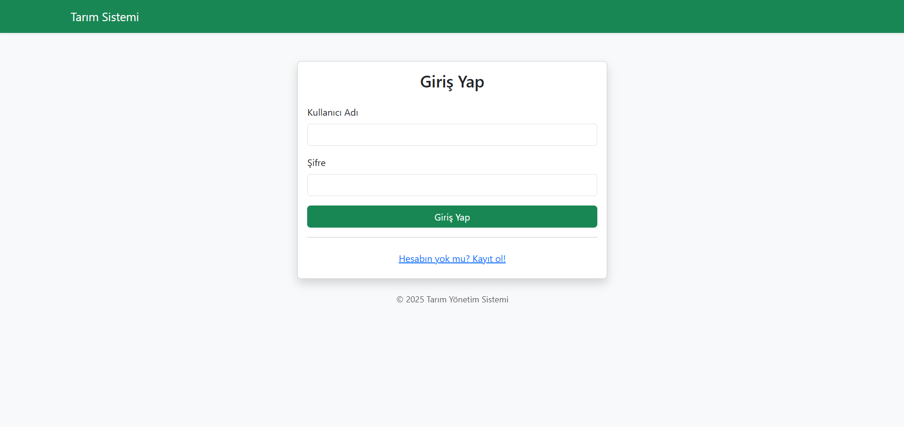
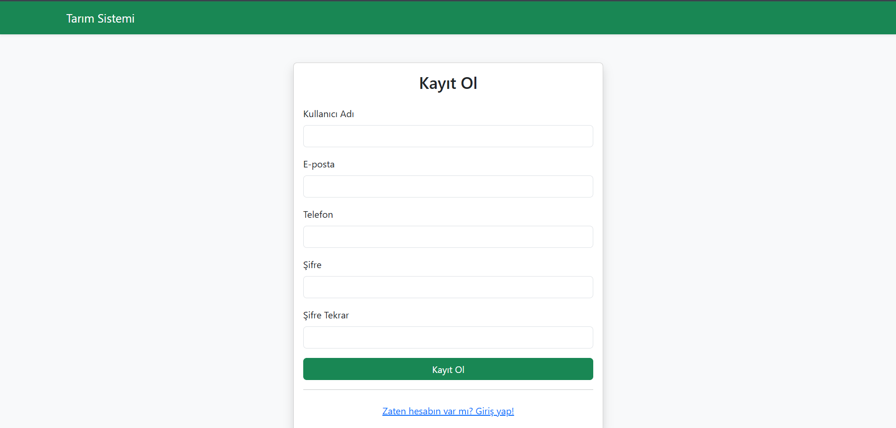
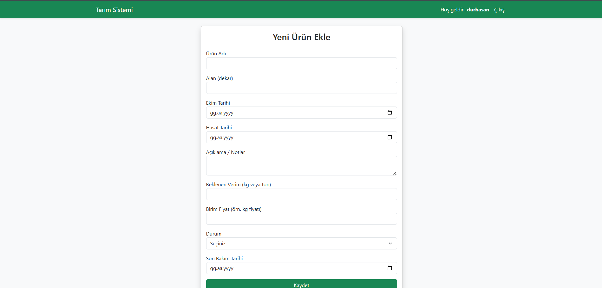
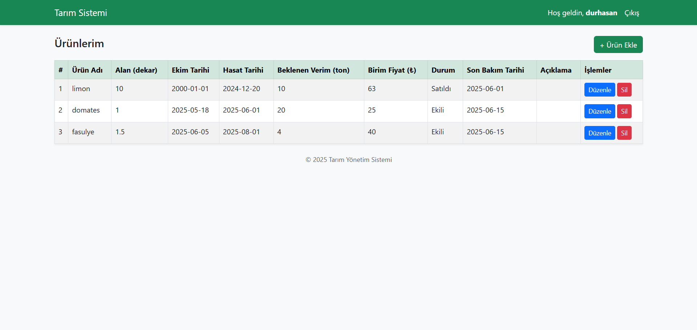
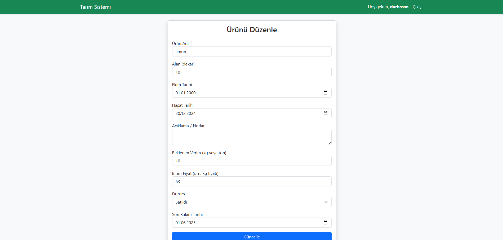

# tarim_yonetim_sistemi

Bu proje, PHP ve MySQL kullanılarak geliştirilmiş sade bir web tabanlı tarımsal ürün yönetim sistemidir.  
Kullanıcılar sisteme kayıt olup giriş yapabilir, kendi ürün kayıtlarını oluşturabilir, düzenleyebilir ve silebilir.

## Özellikler

- Kullanıcı kaydı ve şifreli giriş (hash ile)
- Oturum kontrolü (session ile)
- Ürün ekleme, düzenleme ve silme
- Ürünlere ait; alan, ekim/hasat tarihi, beklenen verim, birim fiyat, durum, son bakım tarihi, not gibi alanlar
- Bootstrap ile sade ve mobil uyumlu arayüz

## Kullanılan Teknolojiler

- PHP (yalın)
- MySQL
- Bootstrap 5

## Kurulum

1. Proje dosyalarını web sunucunuzun (ör: XAMPP `htdocs`) dizinine atın.
2. MySQL'de yeni bir veritabanı oluşturun ve `users` ile `products` tablolarını oluşturmak için SQL dosyasını uygulayın.
3. `classes/Database.php` dosyasında gerekirse veritabanı bağlantı bilgilerini güncelleyin.
4. Tarayıcıda `register.php` ile yeni kullanıcı kaydı oluşturup sisteme giriş yapabilirsiniz.

## Ekran Görüntüleri

Aşağıda uygulamadan bazı örnek ekran görüntüleri görebilirsiniz:

## Proje Canlı Demo

[Tarım Yönetim Sistemi ]([https://youtu.be/örneklik-video-linki](http://95.130.171.20/~st23360859720/tarim_yonetim/login.php))

---
